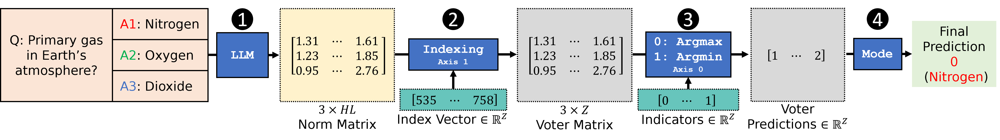
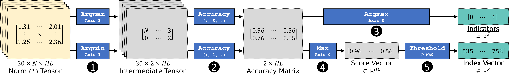

# Introduction
Norm Voting (NoVo) for reducing hallucinations in multiple-choice question answering. 


> **Tip**: set aside a CUDA GPU with atleast 16GB memory, and enough disk space to download 7B model weights from huggingface, to run the experiments below.

# Zero-Shot MCQ Answering with NoVo

Quickstart from top-level directory
```
python main.py --model mistral-7b-it --dataset tqa
```
Zero-shot MCQ results reported in our paper can be reproduced with `main.py`. Simply select the desired model and dataset to start inference. Depending on your machine and dataset size, inference will take anywhere between a minute to over an hour. After inference is completed, the validation accuracy, model and dataset name will be printed out.

__Models__  
[Mistral-7B-Instruct-v0.2](https://huggingface.co/mistralai/Mistral-7B-Instruct-v0.2) (`mistral-7b-it`), [Llama2-7B](https://huggingface.co/meta-llama/Llama-2-7b-hf) (`llama2-7b`), [Llama2-7B-Chat](https://huggingface.co/meta-llama/Llama-2-7b-chat-hf) (`llama2-7b-chat`), and [Vicuna-7B-v1.5](https://huggingface.co/lmsys/vicuna-7b-v1.5) (`vicuna-7b`) are all available for inference. Their weights can be downloaded from huggingface via   
```python
from transformers import AutoModelForCausalLM
_ = AutoModelForCausalLM.from_pretrained('mistralai/Mistral-7B-Instruct-v0.2')
```  
__Datasets__  
The `data/datasets.p` file contains the validation split of the corresponding datasets below to facilitate the reproduction of the results published in our paper.
1.  <ins>CommonsenseQA-2.0</ins> (`csqa2`) by [Talmor Et Al.](https://arxiv.org/abs/2201.05320) available [on GitHub](https://allenai.github.io/csqa2/).
2.  <ins>QASC</ins> (`qasc`) by [Khot Et Al.](https://arxiv.org/abs/1910.11473) available [on Huggingface](https://huggingface.co/datasets/allenai/qasc).
3.  <ins>SWAG</ins> (`swag`) by [Zellers Et Al.](https://arxiv.org/abs/1808.05326) available [here](https://rowanzellers.com/swag/).
4.  <ins>HellaSWAG</ins> (`hellaswag`) by [Zellers Et Al.](https://arxiv.org/abs/1905.07830) available [here](https://rowanzellers.com/hellaswag/).
5.  <ins>Social IQA</ins> (`siqa`) by [Sap Et Al.](https://arxiv.org/abs/1904.09728) available [here](https://leaderboard.allenai.org/socialiqa/submissions/get-started).
6.  <ins>Phyiscal IQA</ins> (`piqa`) by [Bisk Et Al.](https://arxiv.org/abs/1911.11641) available [on GitHub](https://github.com/ybisk/ybisk.github.io/tree/master/piqa).
7.  <ins>Cosmos QA</ins> (`cosmosqa`) by [Huang Et Al.](https://arxiv.org/pdf/1909.00277) available [here](https://wilburone.github.io/cosmos/). 
8.  <ins>CICERO</ins> (`cicero` or `cicero2`) by [Ghosal Et Al.](https://aclanthology.org/2022.acl-long.344/) available [on GitHub](https://github.com/declare-lab/TEAM).


# Norm Selection

Quickstart from top-level directory
```
python discovery.py --model mistral-7b-it --dataset tqa
```
All 7B decoder models provided here come with 32 layers, each with 32 heads per attention sublayer, for a total of 1024 heads throughout the network. Using indices between 0 to 1023 is a convenient way to locate and identify heads. Which layer a head belongs to can be calculated by floor diving its index with the number of layers (32 in this case). Head indices are already provides in `heads.p` to facilliate inference. Full list of models and datasets available in [the previous section](#zero-shot-mcq-answering-with-novo).

Norm Selection is implemented in `discovery.py`. Each model and dataset combination comes with 30 randomly drawn samples from their respective official training splits, excluding TruthfulQA which uses Arc-Easy's train split. Running `discovery.py` enables head indices to be identified from the ground up given a quantile threshold and set of samples. These head indices can be saved and re-used for inference to achieve the same validation accuracy. Alternatively, any other arbitrary samples can be used in this script to discover a new set of heads with different validation results. Note that Norm Selection is only performed once for each dataset.

# Finetuning with NoVo
All credits to [Ghosal et al.](https://aclanthology.org/2022.emnlp-main.691/) for the original fine-tuning codebase and reproduced results for TEAMs and the original standard fine-tuning results for their respective datasets. Follow the step-by-step instructions below to start fine-tuning with head norms.

1.  Clone the [TEAMs project on GitHub](https://github.com/declare-lab/TEAM/commit/2da79aef133808b8db67536ae5ca7c7847982573) to your machine.
2.  Follow their instructions to download and process the datasets to get started on training.
3.  Once you are are able to start training, replace the default DeBERTa from huggingface with our customised one at `models/custom_deberta.py`. This model collates and feeds only heads norms to the classification layer.
4.  Set the learning rate and epoch number as defined in our paper.
5.  Before initialising the dataloader, undo all binary reformulations required for TEAMs. The head norm fine-tuning approach reverts back to the original N class labels, with sequences padded and batched. Sequences may be embedding and fed into the model with the canonical format `(bsz, seq_len, fdim)`, but the classification layer expects input shape `(real_bsz, N, seq_len, total_heads)`. In this case `bsz` can be unrolled to `real_bsz * N`.
6.  Start training and save all model weights after the set number of epochs.
7.  Submit test predictions to the [AllenAI Leaderboard](https://leaderboard.allenai.org/). Test predictions with finetuned DeBERTa can be produced with `test.py`.
